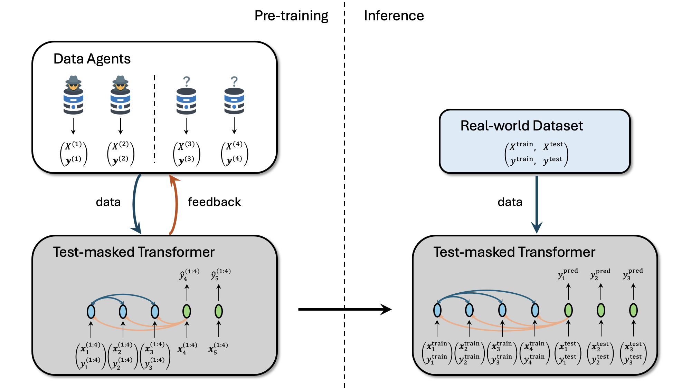

# Adversarially Pre-trained Transformer

This repository is the official implementation of [**Zero-shot Meta-learning for Tabular Prediction Tasks with Adversarially Pre-trained Transformer**](https://arxiv.org/abs/2502.04573).



```BiBTeX
@article{wu2025zero,
  title={Zero-shot Meta-learning for Tabular Prediction Tasks with Adversarially Pre-trained Transformer},
  author={Wu, Yulun and Bergman, Doron L},
  journal={International Conference on Machine Learning},
  year={2025}
}
```


## Installation

### 1. Create Conda Environment
```bash
conda create -n apt-env python=3.10
conda activate apt-env
```

### 2. Install Learning Library
- [Pytorch](https://pytorch.org/) [**2.3**.1](https://pytorch.org/get-started/previous-versions/)

  \* *make sure to install the right versions for your toolkit*

### 3. Install Dependencies
```bash
pip install -r requirements.txt
pip install -e .
```


## Evaluation

See `evaluate_classification.ipynb` and `evaluate_regression.ipynb` for examples.


## Pre-training

```bash
./main.sh
```

A list of flags may be found in `main.sh` and `main.py` for experimentation with different hyperparameters. The run log is saved under `logs/`, models are saved under `*artifact_path*/saves`, and the tensorboard log is saved under `*artifact_path*/runs`.


## Checkpoints

Our checkpoints are stored [here](https://osf.io/c67wt/).


## License

Contributions are welcome! All content here is licensed under the MIT license.
